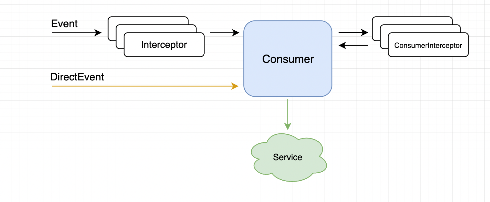

[](https://repo1.maven.org/maven2/io/github/ppav) [](https://opensource.org/licenses/MIT)

## Analytics




Kotlin Multiplatform  library as a simple facade or abstraction for analytics

## Download
```kotlin
dependencies {
  //...
  implementation("io.github.ppav.analytics:analytics:${latest_version}")
  
  
  //optional
  implementation "io.github.ppav.analytics:consumer-firebase:${latest_version}"
  implementation "io.github.ppav.analytics:consumer-yandexmetrika:${latest_version}"
  implementation "io.github.ppav.analytics:consumer-amplitude:${latest_version}"  

}
```


## Usage

```kotlin
 val analytics = Analytics.Builder()
  .addConsumer(YandexMetricaConsumer(YANDEX_EVENTS))
  .addConsumer(`fooConsumer`)
  .addInterceptor(CommonInterceptor())
  .addConsumerInterceptor(FooConsumerInterceptor())

  .setExceptionHandler { error -> logger.warning(error.message ?: "") }
  .setDebugLog(true) // enable trace log
  .build()

```

## Event 


```kotlin
/* Example */
fun fooEvent(param: String) = Event.Builder("event_foo")
      .withParam("fooParam", param)
      .build()
```

```kotlin
fun revenueEvent(productName: String, sum: Sum) = listOf(

    /* common event */
    Event.Builder("event_revenue")
      .withSum(sum)
      .withParam("productName", productName)
      .build(),
      
    /* direct event */
    YandexMetricaDirectEvent.revenue(sum, productName)
  )

```


Track event
```kotlin
analytics.track(revenueEvent("param", Sum(3.0, "USD")))
```

## Consumer

Example of consumer
```kotlin 
/* Example */
class FooConsumer(val handleEvents: List<String>): AnalyticsConsumer {

  /* true if you want to receive an event */
  fun canAccept(event: String) : Boolean = handleEvents.contains(event) 

  /* handle the event */
  fun acceptEvent(event: AnalyticsEvent) {} 
}
```


## Interceptor 

Intercepts all events (excludes DirectEvent)
Can be used to add default parameters to events

```kotlin
interface Interceptor {
  suspend fun intercept(event: Event): Event
}
```

```kotlin
/* Example */
class CommonInterceptor : Interceptor {
  override suspend fun intercept(event: Event) =
    event.copy(params = event.params + mapOf("deviceId" to "ID", "userId" to "ID"))
}
```

#### ConsumerInterceptor
Can intercept events for specific consumers 


```kotlin
/* Example */
class FooConsumerInterceptor : ConsumerInterceptor {
  override suspend fun intercept(
    consumer: AnalyticsConsumer,
    event: Event
  ) = takeIf { consumer is FooConsumer }
      ?.let { event.copy(params = event.params + ("fooUserId" to "ID")) }
      ?: event
}
```


## License
```
MIT License

Copyright (c) 2022 (@ppav)

Permission is hereby granted, free of charge, to any person obtaining a copy
of this software and associated documentation files (the "Software"), to deal
in the Software without restriction, including without limitation the rights
to use, copy, modify, merge, publish, distribute, sublicense, and/or sell
copies of the Software, and to permit persons to whom the Software is
furnished to do so, subject to the following conditions:

The above copyright notice and this permission notice shall be included in all
copies or substantial portions of the Software.

THE SOFTWARE IS PROVIDED "AS IS", WITHOUT WARRANTY OF ANY KIND, EXPRESS OR
IMPLIED, INCLUDING BUT NOT LIMITED TO THE WARRANTIES OF MERCHANTABILITY,
FITNESS FOR A PARTICULAR PURPOSE AND NONINFRINGEMENT. IN NO EVENT SHALL THE
AUTHORS OR COPYRIGHT HOLDERS BE LIABLE FOR ANY CLAIM, DAMAGES OR OTHER
LIABILITY, WHETHER IN AN ACTION OF CONTRACT, TORT OR OTHERWISE, ARISING FROM,
OUT OF OR IN CONNECTION WITH THE SOFTWARE OR THE USE OR OTHER DEALINGS IN THE
SOFTWARE.
```
